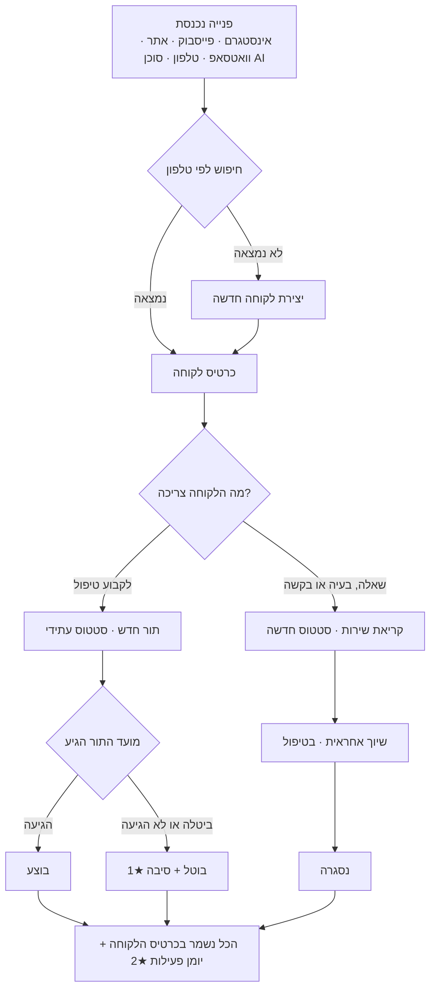
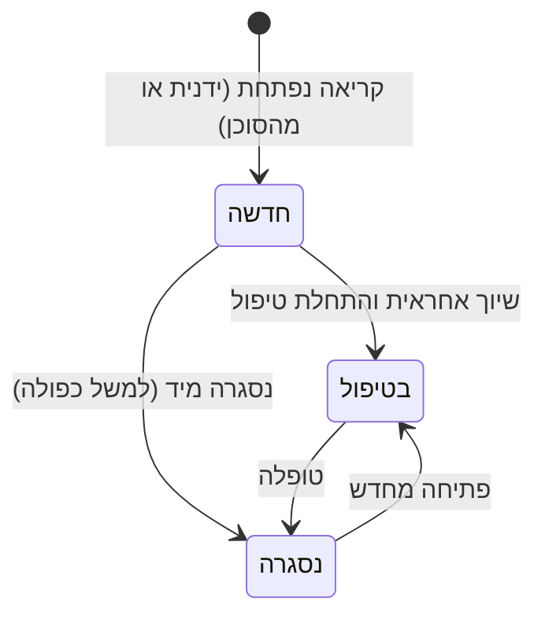
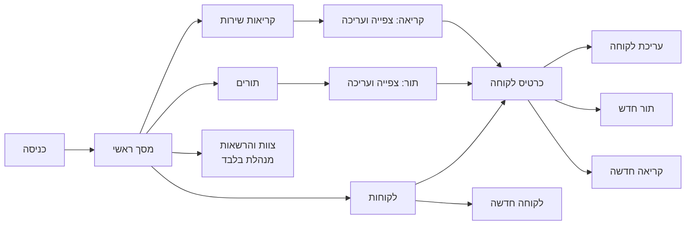
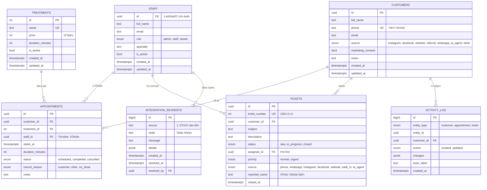
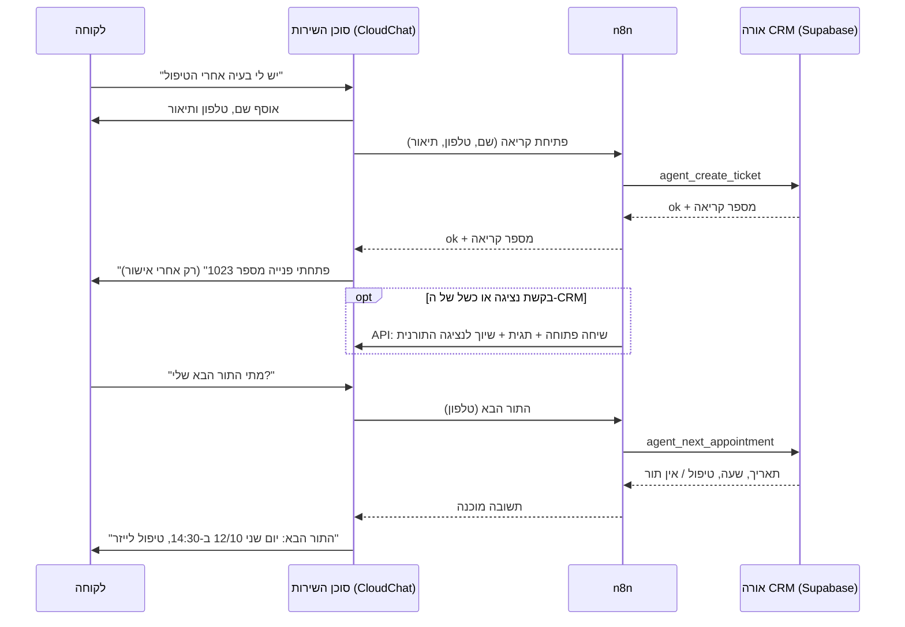

# PRD · מערכת CRM לקליניקת אורה

| | |
|---|---|
| **מוצר** | "אורה CRM": מערכת פנימית לניהול לקוחות, תורים וקריאות שירות |
| **לקוח** | קליניקת אורה, רפואה אסתטית · סוקולוב 48, הרצליה · בעלים: רותם ברנע |
| **גרסת מסמך** | 1.0 · 08.10.2026 |
| **כתב** | רועי איזן |
| **סטטוס** | מאושר לפיתוח, גרסה 1 (MVP) |

> **בשורה אחת:** מקום אחד שבו כל הצוות רואה מי הלקוחה, מתי התור הבא שלה ומה קורה עם כל פנייה שלה, ורותם רואה את כל התמונה במסך אחד.

**סימונים במסמך:** ★ = פיצ'ר נוסף מעבר למפרט הקשיח (שלושה כאלה, מפורטים בסעיף 1.5) · `BR-xx` = כלל עסקי (סעיף 8) · `FR-xx` = דרישה פונקציונלית (נספח ד').

**גרסה להדפסה ולקריאה בנייד:** [PRD.pdf](PRD.pdf). אותו תוכן, עם התרשימים.

### תקציר מנהלים

- **מה:** מערכת CRM פנימית בעברית, שמרכזת סביב כרטיס לקוחה אחד את הפרטים, התורים וקריאות השירות.
- **למי:** רותם (מנהלת) וליאת ונטע (מטפלות), בעיקר מהנייד בין טיפולים.
- **מה פותר:** מידע מפוזר וכפול, תורים בכמה יומנים, פניות בלי בעלים, ואין תמונת מצב.
- **מה מודדים:** 0 כפילויות, אף פנייה בלי אחראית, הברזות מ-35% ל-20% (סעיף 1.3).
- **מה לא בגרסה 1:** תיאום אוטומטי, יומן חיצוני, כספים, סליקה ואימיילים (נספח א').

### מפת עמידה במפרט

| דרישה במפרט | איפה במסמך | בדיקת קבלה |
|---|---|---|
| צוות: רותם, ליאת ונטע, וניהול הרשאות | 2.1, 5.10, 7 | FR-09 |
| לקוחות: יצירה, עדכון וצפייה בכרטיס עם שם וטלפון | 5.4, 5.5, 8.1 | FR-01, FR-03 |
| רשימת לקוחות וחיפוש לפי טלפון | 5.3, `BR-03` | FR-02 |
| תורים: יצירה, עדכון וצפייה, מקושר ללקוחה, סוג טיפול, תאריך ושעה | 5.6, 5.7, 8.2 | FR-04 |
| סטטוסי תור (עתידי, בוצע, בוטל) והיסטוריית תורים | `BR-05`, `BR-08`, 5.4 | FR-05 |
| קריאות: יצירה, עדכון וצפייה, מקושרת ללקוחה, תיאור, סטטוס ואחראית | 5.8, 5.9, 8.3 | FR-06, FR-07 |
| מסך ראשי: פניות פתוחות ובטיפול, והאחראיות להן | 5.2 | FR-08 |
| ניווט, מידע ופעולות בכל מסך | 4, 5 | FR-11 |
| קישור תורים וקריאות לכרטיס הלקוחה, וצפייה בהם דרכו | `BR-04`, 5.4 | FR-04, FR-06 |
| 2-3 פיצ'רים מעבר למפרט | 1.5 (★1, ★2, ★3) | FR-12, FR-13, FR-14 |
| מחוץ לתחום: תיאום אוטומטי, יומן חיצוני, כספים, סליקה, אימיילים | 1.4, נספח א' | — |
| 11 סעיפי המבנה | סעיפים 1-11, לפי הסדר | — |

---

## תוכן עניינים

1. [רקע ומטרות](#1-רקע-ומטרות)
2. [קהלי יעד](#2-קהלי-יעד)
3. [Flow של המערכת](#3-flow-של-המערכת)
4. [מבנה מסכים וניווט](#4-מבנה-מסכים-וניווט)
5. [פירוט מסכים](#5-פירוט-מסכים)
6. [סגנון עיצובי](#6-סגנון-עיצובי)
7. [הרשאות ותפקידים](#7-הרשאות-ותפקידים)
8. [לוגיקה עסקית](#8-לוגיקה-עסקית)
9. [מבנה נתונים](#9-מבנה-נתונים)
10. [אוטומציות ואינטגרציות](#10-אוטומציות-ואינטגרציות)
11. [התראות והודעות](#11-התראות-והודעות)

נספחים: [א' מחוץ לתחום](#נספח-א-מחוץ-לתחום) · [ב' דרישות לא-פונקציונליות](#נספח-ב-דרישות-לא-פונקציונליות) · [ג' הנחות ושאלות פתוחות](#נספח-ג-הנחות-ושאלות-פתוחות) · [ד' קריטריוני קבלה](#נספח-ד-קריטריוני-קבלה) · [ה' מפת דרכים](#נספח-ה-מפת-דרכים) · [ו' שלבי פיתוח](#נספח-ו-שלבי-פיתוח) · [ז' פרטיות ואבטחת מידע](#נספח-ז-פרטיות-ואבטחת-מידע) · [ח' הטמעה ותפעול](#נספח-ח-הטמעה-ותפעול)

---

## 1. רקע ומטרות

### 1.1 רקע

קליניקת אורה היא קליניקה לרפואה אסתטית בהרצליה. בצוות שלוש: רותם ברנע (בעלים, טיפולי פנים ואנטי-אייג'ינג), ליאת כהן (לייזר) ונטע אדרי (בוטוקס וחומצה היאלורונית). שעות הפעילות: א'-ה' 09:00-19:00, ו' 09:00-13:00.

| נתון תפעולי | היום |
|---|---|
| פניות בשבוע | 40-50 (45% אינסטגרם, 25% פייסבוק, 20% טופס באתר, 10% פה לאוזן) |
| המרה לטיפול ניסיון | כ-30% |
| הברזות מתורים שנקבעו | כ-35% |
| זמן תגובה ממוצע לפנייה | 6-12 שעות, לעיתים יום-יומיים |

**הבעיה:** המידע מפוזר. פרטי לקוחות נמצאים בכמה מקומות (וואטסאפ, הודעות באינסטגרם ובפייסבוק, טופס האתר, רשימות אישיות) ויש כפילויות. התורים מנוהלים בכמה יומנים, ולכן קשה לדעת מה התור הבא של לקוחה ומה עבר עליה. לפניות שירות אין בעלים ואין סטטוס, והן הולכות לאיבוד. לרותם אין תמונת מצב: כמה פניות פתוחות, מה בטיפול ומי אחראית.

**המחיר העסקי, הערכה:** כ-195 פניות בחודש מובילות לכ-58 טיפולי ניסיון. בשיעור הברזות של 35%, כ-20 מהם לא מתקיימים, כלומר כ-15 שעות טיפול ריקות בחודש. זה עוד לפני הטיפולים שהיו נמכרים אחריהם (סדרת לייזר ב-3,000 ₪, מילוי ב-1,200 ₪). בנוסף, פנייה שנענית אחרי 12 שעות "מתקררת", והלקוחה כבר פנתה למתחרה.

### 1.2 מטרת המוצר

מערכת CRM פנימית ופשוטה, בעברית, שנוחה גם בנייד. היא מרכזת סביב **כרטיס לקוחה אחד** את פרטי הלקוחה, את כל התורים שלה ואת כל קריאות השירות שלה, ומציגה לרותם מסך ראשי עם תמונת מצב.

המערכת היא גם התשתית לסוכן השירות הדיגיטלי של הקליניקה: הסוכן פותח בה קריאות ושולף ממנה את התור הבא של לקוחה (סעיף 10.2).

### 1.3 מטרות ומדדי הצלחה

| # | מטרה עסקית | מדד | יעד, 3 חודשים מהעלייה לאוויר |
|---|---|---|---|
| M1 | כרטיס לקוחה אחד לכל לקוחה | כפילויות לפי מספר טלפון | 0, נאכף במערכת (`BR-02`) |
| M2 | מידע זמין מיד | זמן לאיתור לקוחה לפי טלפון | עד 10 שניות |
| M3 | תמונת תורים אמינה | תורים שמועדם עבר ועדיין בסטטוס "עתידי" בסוף היום | פחות מ-5% |
| M4 | פחות הברזות | שיעור הברזות, נמדד במערכת (★1) | מ-35% ל-20%, בשילוב נוהל אישור הגעה |
| M5 | אף פנייה לא הולכת לאיבוד | קריאות פתוחות עם סטטוס ואחראית | 100% |
| M6 | תגובה מהירה | זמן מפתיחת קריאה ועד שהיא "בטיפול" | עד שעתיים בשעות הפעילות |
| M7 | שליטה ניהולית | קריאות פתוחות מעל 48 שעות (★3) | 0 בסוף כל שבוע |
| M8 | אימוץ | פניות חדשות שנרשמות במערכת | 100% אחרי שבועיים |

### 1.4 היקף גרסה 1

**בתוך התחום:** ניהול לקוחות, ניהול תורים, קריאות שירות, מסך ראשי, ניהול צוות והרשאות, מחירון טיפולים, ממשק לסוכן השירות, ושלושת הפיצ'רים הנוספים (סעיף 1.5).

**מחוץ לתחום, לפי המפרט:** תיאום תורים אוטומטי, יומן חיצוני, כספים, סליקה ואימיילים. פירוט בנספח א'.

### 1.5 שלושה פיצ'רים נוספים (★) ולמה דווקא הם

| ★ | פיצ'ר | מה הוא עושה | למה, ומה הוא פותר |
|---|---|---|---|
| ★1 | **מעקב הברזות** | בביטול תור חובה לבחור סיבה מרשימה סגורה: "ביטול של הלקוחה", "ביטול של הקליניקה", "לא הגיעה". המסך הראשי מציג את שיעור ההברזות ב-30 הימים האחרונים. | ההברזות (35%) הן הדליפה הכספית הגדולה של הקליניקה. מה שלא נמדד לא משתפר: המדידה היא הבסיס לנוהל אישור הגעה ולתזכורות בגרסה הבאה. זה לא משנה את שלושת הסטטוסים שבמפרט, רק מוסיף סיבה לביטול. |
| ★2 | **יומן פעילות** | כל יצירה ועדכון של לקוחה, תור או קריאה נרשמים אוטומטית: מי, מתי ומה השתנה (למשל "סטטוס: חדשה ← בטיפול"). היומן מוצג בכרטיס הלקוחה ובכל קריאה. | עונה על "מי אחראית ומה נעשה" בלי לשאול בוואטסאפ. בקליניקה אסתטית יש גם ערך של אחריותיות ובקרה: אפשר לדעת מי שינה תור או סגר פנייה. |
| ★3 | **בקרת זמני טיפול (SLA)** | קריאה פתוחה מעל 48 שעות מסומנת כ"חורגת" ובולטת באדום. קריאה חדשה בלי אחראית נספרת כ"ממתינה לשיוך". מסנן "הקריאות שלי" לכל מטפלת. | הופך את "פניות הולכות לאיבוד" לבעיה שרואים בזמן אמת. רותם מטפלת בחריגות ולא צריכה לעבור על כל הרשימה. |

**לא נספרים כפיצ'ר נוסף:** שיפורי שימושיות קטנים (מחירון טיפולים שממלא משך טיפול אוטומטית בקביעת תור, וכפתורי חיוג ווואטסאפ מכרטיס הלקוחה), תפקיד "צפייה בלבד" (חלק מניהול ההרשאות שבמפרט), והממשק לסוכן השירות עם רישום התקלות שלו (סעיפים 10.2 ו-11.3). הממשק לסוכן נדרש כדי לחבר את הסוכן למערכת, והוא לא חלק מהמפרט הקשיח של ה-CRM.

---

## 2. קהלי יעד

### 2.1 משתמשות המערכת

| פרסונה | תפקיד במערכת | מה היא צריכה | מסכים עיקריים | מכשיר | הרשאה |
|---|---|---|---|---|---|
| **רותם ברנע**, בעלים | מנהלת | תמונת מצב יומית, שיוך פניות, מעקב אחרי הצוות, ניהול הרשאות ומחירון | מסך ראשי, קריאות שירות, צוות והרשאות | מחשב בבוקר, נייד במהלך היום | מנהלת |
| **ליאת כהן**, לייזר | מטפלת | לפני טיפול: היסטוריית הלקוחה ובאיזה טיפול היא בסדרת הלייזר. אחרי טיפול: קביעת הטיפול הבא בסדרה וטיפול בקריאות שלה | כרטיס לקוחה, תורים, "הקריאות שלי" | בעיקר נייד, בין טיפולים | מטפלת |
| **נטע אדרי**, בוטוקס ומילוי | מטפלת | מעקב אחרי לקוחות אחרי הזרקה (ביקורת אחרי שבועיים), מענה מהיר לפניות על תופעות לוואי | כרטיס לקוחה, קריאות שירות, תורים | בעיקר נייד | מטפלת |

**הקשר השימוש:** צוות קטן שעובד עם לקוחות פנים מול פנים. רוב השימוש הוא פעולות קצרות בנייד, בין טיפול לטיפול. לכן כל פעולה נפוצה (חיפוש לפי טלפון, פתיחת קריאה, עדכון סטטוס) צריכה לקחת עד 3 הקשות.

### 2.2 קהלים משניים

| קהל | הקשר למערכת |
|---|---|
| **לקוחות הקליניקה** | לא משתמשות במערכת ישירות. הן נוגעות בה דרך סוכן השירות: פתיחת פנייה ובירור התור הבא (סעיף 10.2). |
| **גורם חיצוני לצפייה** | רואה חשבון, יועץ או בודק. תפקיד "צפייה בלבד", רואה הכל ולא משנה דבר. |
| **עובדת קבלה עתידית** | אם הקליניקה תגדל. תקבל את תפקיד "מטפלת" או תפקיד חדש, בלי שינוי קוד (סעיף 7). |

---

## 3. Flow של המערכת

### 3.1 התמונה המלאה: מפנייה ועד סגירה

### 3.2 תהליכי עבודה עיקריים

**תהליך 1: קליטת פנייה חדשה** (מטפלת או מנהלת)
1. פנייה מגיעה בכל ערוץ. מקלידים את הטלפון בחיפוש העליון.
2. נמצאה לקוחה: נכנסים לכרטיס. לא נמצאה: "לקוחה חדשה", והטלפון כבר ממולא.
3. בכרטיס: "קריאה חדשה" (שאלה, בעיה, בקשה) או "תור חדש".
4. קריאה נפתחת בסטטוס "חדשה". אם ידוע מי מטפלת, משייכים מיד.

**תהליך 2: תור, מקביעה ועד סגירה**
1. מכרטיס הלקוחה: "תור חדש". בוחרים טיפול מהמחירון, משך הטיפול מתמלא לבד. בוחרים מטפלת, תאריך ושעה.
2. התור נשמר בסטטוס "עתידי" ומופיע בכרטיס כ"התור הבא".
3. אחרי המועד: מעדכנים ל"בוצע", או ל"בוטל" עם סיבה ★1.
4. בסדרת טיפולים (למשל 6 טיפולי לייזר) קובעים את הבא בתור מאותו כרטיס.

**תהליך 3: מחזור חיים של קריאת שירות**

**תהליך 4: שגרת הבוקר של רותם**
1. נכנסת למסך הראשי: כמה קריאות חדשות, כמה בטיפול, כמה חורגות ★3 וכמה ממתינות לשיוך.
2. טבלת "קריאות פתוחות לפי אחראית" מראה את העומס של כל אחת.
3. לחיצה על שורה פותחת את הקריאות המסוננות. משם משייכת או מעבירה אחראית.
4. מעיפה מבט ב"תורים היום" ובשיעור ההברזות ★1.

**תהליך 5: פנייה דרך סוכן השירות (אינטגרציה, סעיף 10.2)**
1. לקוחה כותבת לסוכן, והסוכן אוסף שם, טלפון ותיאור.
2. המערכת מחפשת לקוחה לפי טלפון, ואם אין, יוצרת אותה.
3. נפתחת קריאה בסטטוס "חדשה", מקור "סוכן AI", ומספר הקריאה חוזר לסוכן.
4. הקריאה מופיעה במסך הראשי כ"ממתינה לשיוך".

**תהליך 6: כניסה למערכת**
כניסה עם אימייל וסיסמה. כל מסך בודק שהמשתמשת מחוברת ופעילה. מי שלא מחוברת מועברת למסך הכניסה, ומשם חוזרת למסך שביקשה.

---

## 4. מבנה מסכים וניווט

### 4.1 מפת מסכים

| נתיב | מסך | מי רואה |
|---|---|---|
| `/login` | כניסה | כולם |
| `/` | מסך ראשי | כל המשתמשות |
| `/customers` | רשימת לקוחות + חיפוש לפי טלפון | כל המשתמשות |
| `/customers/new` | לקוחה חדשה | מנהלת, מטפלת |
| `/customers/[id]` | כרטיס לקוחה | כל המשתמשות |
| `/customers/[id]/edit` | עריכת לקוחה | מנהלת, מטפלת |
| `/appointments` | רשימת תורים | כל המשתמשות |
| `/appointments/new` | תור חדש | מנהלת, מטפלת |
| `/appointments/[id]` | תור: צפייה ועריכה | כל המשתמשות (עריכה: מנהלת, מטפלת) |
| `/tickets` | רשימת קריאות שירות | כל המשתמשות |
| `/tickets/new` | קריאה חדשה | מנהלת, מטפלת |
| `/tickets/[id]` | קריאה: צפייה ועריכה | כל המשתמשות (עריכה: מנהלת, מטפלת) |
| `/team` | צוות, הרשאות ומחירון טיפולים | מנהלת בלבד |

### 4.2 ניווט

- **מחשב:** תפריט צד קבוע בצד ימין (RTL) עם הלוגו, ארבעת המסכים הראשיים, "צוות והרשאות" (למנהלת בלבד), ובתחתית שם המשתמשת, התפקיד ויציאה.
- **נייד:** סרגל ניווט תחתון עם ארבעה אייקונים (ראשי, לקוחות, תורים, קריאות). סרגל עליון עם הלוגו ותפריט משתמשת. כל אזורי ההקשה בגודל 44 פיקסלים לפחות.
- **חיפוש טלפון גלובלי:** שדה חיפוש בראש כל מסך. הקלדת טלפון והקשה על Enter מובילות לרשימת הלקוחות המסוננת, ואם יש התאמה מדויקת אחת, ישר לכרטיס.
- **פעולות יצירה מהירות:** "לקוחה חדשה", "תור חדש", "קריאה חדשה" זמינות מהמסך הראשי ומכל רשימה.
- **קישורים בין ישויות:** בכל תור ובכל קריאה שם הלקוחה הוא קישור לכרטיס שלה. בכרטיס יש קישור לכל תור ולכל קריאה. כך עונים על "מה קורה עם הלקוחה" מכל נקודה.
- **חזרה:** בכל מסך פרטים יש קישור "חזרה" למסך שממנו הגיעו (רשימה או כרטיס).

---

## 5. פירוט מסכים

### 5.1 כניסה

| | |
|---|---|
| **מטרה** | כניסה מאובטחת לצוות בלבד |
| **מידע** | לוגו ושם הקליניקה, שדה אימייל, שדה סיסמה |
| **פעולות** | "כניסה" |
| **מצבים** | פרטים שגויים: "האימייל או הסיסמה שגויים". משתמשת שהושבתה: "המשתמשת אינה פעילה, יש לפנות לרותם". אין הרשמה עצמית: משתמשות חדשות נוספות על ידי מנהלת. |

### 5.2 מסך ראשי

| | |
|---|---|
| **מטרה** | תמונת מצב של הקליניקה ב-10 שניות |
| **מי** | כל המשתמשות. מנהלת רואה את כל הצוות, ומטפלת רואה גם את כרטיס "הקריאות שלי". |

**מידע מוצג:**
0. **באנרים (מופיעים רק כשיש מה להראות):** "ביקשו נציגה" (קריאות דחופות מהסוכן בסטטוס "חדשה", עם קישור לכל קריאה), ו"תקלה בחיבור לסוכן" (תקלות שדיווח n8n ועוד לא סומנו "טופל", עם כפתור "טופל"). ראו 11.1.
1. **כרטיסי מדדים (KPI):** קריאות חדשות · קריאות בטיפול · ממתינות לשיוך ★3 · חורגות מעל 48 שעות ★3 · תורים היום · שיעור הברזות ב-30 יום ★1.
   **לחיצה על כרטיס** פותחת את הרשימה המסוננת: חדשות ← קריאות בסטטוס "חדשה" · בטיפול ← "בטיפול" · ממתינות לשיוך ← חדשות בלי אחראית · חורגות ← פתוחות מעל 48 שעות · תורים היום ← תורי היום. שיעור ההברזות מוצג עם פירוט ("X לא הגיעו מתוך Y"), ואינו קישור.
2. **קריאות פתוחות לפי אחראית:** טבלה עם שורה לכל אחת מהצוות ושורת "לא שויכה". עמודות: חדשות, בטיפול, חורגות, סה"כ. לחיצה על שורה פותחת את רשימת הקריאות מסוננת לאותה אחראית.
3. **קריאות פתוחות אחרונות:** עד 8 קריאות. בכל אחת: מספר, לקוחה, תיאור מקוצר, סטטוס, אחראית, גיל הקריאה. חורגת מסומנת באדום.
4. **התורים של היום:** שעה, לקוחה, טיפול, מטפלת, סטטוס.

**פעולות:** לקוחה חדשה · תור חדש · קריאה חדשה · חיפוש לפי טלפון · מעבר לכל רשימה.

**נייד:** כרטיסי המדדים ברשת של 2 עמודות, והטבלאות הופכות לכרטיסים.

### 5.3 רשימת לקוחות

| | |
|---|---|
| **מטרה** | למצוא לקוחה מהר, בעיקר לפי טלפון |
| **מידע** | שם, טלפון, התור הבא (תאריך וטיפול), מספר קריאות פתוחות, מקור הגעה |
| **חיפוש** | לפי טלפון, מלא או חלקי (למשל 4 ספרות אחרונות), בכל פורמט: `054-782-1390`, `0547821390`, `+972547821390`. גם לפי שם. |
| **מיון** | עדכון אחרון קודם |
| **פעולות** | "לקוחה חדשה" · לחיצה על שורה פותחת כרטיס |
| **מצב ריק** | "לא נמצאה לקוחה עם הטלפון הזה", עם כפתור "יצירת לקוחה חדשה" שהטלפון כבר ממולא בו |
| **נייד** | כל לקוחה בכרטיס עם כפתור חיוג |

### 5.4 כרטיס לקוחה (מסך המפתח)

| | |
|---|---|
| **מטרה** | כל מה שצריך לדעת על לקוחה, במקום אחד |

**מידע מוצג:**
1. **כותרת:** שם מלא, טלפון (קישור לחיוג ולוואטסאפ), אימייל, מקור הגעה, הסכמה לדיוור, תאריך הצטרפות, הערות.
2. **"התור הבא":** תאריך, יום, שעה, טיפול ומטפלת, מודגש בראש הכרטיס. אם אין: "אין תור עתידי".
3. **תורים:** עתידיים, ומתחתם היסטוריה מהחדש לישן, עם סטטוס, סיבת ביטול ★1 ומטפלת. לכל תור קישור לעריכה.
4. **קריאות שירות:** פתוחות קודם, ואחריהן סגורות. מספר, תיאור, סטטוס, אחראית, תאריך פתיחה.
5. **יומן פעילות ★2:** 20 הפעולות האחרונות על הלקוחה, התורים והקריאות שלה. מי, מתי, מה.

**פעולות:** עריכה · תור חדש (הלקוחה ממולאת) · קריאה חדשה (הלקוחה ממולאת) · חיוג · וואטסאפ · מחיקה (מנהלת בלבד, אחרי אישור שמציג כמה תורים וקריאות יימחקו).

**נייד:** הסעיפים נערמים אחד מתחת לשני. "התור הבא" והכפתורים נשארים למעלה.

### 5.5 טופס לקוחה (חדשה ועריכה)

| שדה | חובה | הערות |
|---|---|---|
| שם מלא | כן | 2 תווים לפחות |
| טלפון | כן | ישראלי, נייד או קווי. מנורמל (`BR-01`) וייחודי (`BR-02`) |
| אימייל | לא | בדיקת תבנית |
| מקור הגעה | לא | רשימה סגורה: אינסטגרם, פייסבוק, אתר, פה לאוזן, וואטסאפ, סוכן AI, אחר |
| הסכמה לקבלת דיוור | לא | תיבת סימון, ברירת מחדל: לא |
| הערות | לא | טקסט חופשי |

**שגיאה ייחודית:** טלפון שכבר קיים מציג "הטלפון כבר שייך ל<שם>" עם קישור לכרטיס הקיים, במקום ליצור כפילות.

### 5.6 רשימת תורים

| | |
|---|---|
| **מסננים** | טווח: היום (ברירת מחדל) · השבוע · עתידיים · עבר · הכל. סטטוס: עתידי, בוצע, בוטל. מטפלת. |
| **מידע** | תאריך ושעה, לקוחה (קישור לכרטיס), טלפון, טיפול, מטפלת, סטטוס, סיבת ביטול |
| **מיון** | עתידיים: הקרוב קודם. עבר: האחרון קודם. |
| **פעולות** | תור חדש · לחיצה פותחת את התור לעריכה |

### 5.7 טופס תור (חדש וצפייה/עריכה)

| שדה | חובה | הערות |
|---|---|---|
| לקוחה | כן | בחירה לפי חיפוש טלפון או שם. ממולא אוטומטית כשנכנסים מכרטיס לקוחה. |
| סוג טיפול | כן | מתוך המחירון. מציג מחיר ומשך. |
| מטפלת | לא | מתוך הצוות הפעיל |
| תאריך | כן | ברירת מחדל: היום |
| שעה | כן | בשעות הפעילות (`BR-06`) |
| משך (דקות) | כן | מתמלא מהמחירון, ניתן לשינוי |
| סטטוס | כן | עתידי (ברירת מחדל) · בוצע · בוטל |
| סיבת ביטול ★1 | רק כשבוטל | ביטול של הלקוחה · ביטול של הקליניקה · לא הגיעה |
| הערות | לא | |

במצב צפייה מוצגים גם "נוצר על ידי" ויומן הפעילות של התור ★2.

### 5.8 רשימת קריאות שירות

| | |
|---|---|
| **מסננים** | סטטוס: פתוחות (חדשה + בטיפול, ברירת מחדל) · חדשה · בטיפול · נסגרה · הכל. אחראית: הכל · שלי ★3 · לא שויכה · לפי שם. חורגות בלבד ★3. |
| **מידע** | מספר קריאה (#1001), לקוחה (קישור), תיאור מקוצר, סטטוס, אחראית, מקור, עדיפות, גיל הקריאה. חורגת מסומנת באדום ★3. |
| **מיון** | החדשה קודם |
| **פעולות** | קריאה חדשה · לחיצה פותחת את הקריאה |

### 5.9 קריאת שירות (חדשה וצפייה/עריכה)

| שדה | חובה | הערות |
|---|---|---|
| לקוחה | כן | חיפוש לפי טלפון או שם, או ממולא מהכרטיס |
| נושא | לא | כותרת קצרה. אם ריק, נלקחות המילים הראשונות של התיאור. |
| תיאור הפנייה | כן | |
| סטטוס | כן | חדשה (ברירת מחדל) · בטיפול · נסגרה |
| אחראית | רק בסטטוס "בטיפול" (`BR-09`) | מתוך הצוות הפעיל |
| עדיפות | כן | רגילה (ברירת מחדל) · דחופה |
| מקור | לא | טלפון, וואטסאפ, אינסטגרם, פייסבוק, אתר, פרונטלי, סוכן AI |

במצב צפייה: תאריך פתיחה, תאריך סגירה, "נפתחה על ידי" (כולל "סוכן AI") ויומן הפעילות של הקריאה ★2. כפתורי קיצור: "התחלת טיפול" (משייך אליי ומעביר ל"בטיפול") ו"סגירה".

### 5.10 צוות והרשאות (מנהלת בלבד)

| | |
|---|---|
| **צוות** | שם, אימייל, תפקיד (מנהלת, מטפלת, צפייה בלבד), התמחות, פעילה או לא. שינוי תפקיד והשבתה בלחיצה. |
| **מחירון טיפולים** | שם, מחיר, משך, פעיל. עריכת מחיר ומשך, הוספת טיפול והוצאה משימוש. |
| **הגנות** | אי אפשר להשבית את עצמך או להוריד את עצמך מתפקיד מנהלת. חייבת להישאר לפחות מנהלת פעילה אחת (`BR-12`). |
| **הוספת משתמשת** | בגרסה 1 דרך לוח הבקרה של Supabase (Auth ← Add user). המשתמשת נוצרת אוטומטית בצוות כ"צפייה בלבד" ולא פעילה, ורותם מפעילה אותה וקובעת תפקיד במסך "צוות והרשאות". הזמנה ישירות מהממשק: גרסה 1.1. |

---

## 6. סגנון עיצובי

### 6.1 עקרונות

"אורה" היא אור. המערכת צריכה להרגיש כמו הקליניקה: נקייה, רגועה, מוקפדת, בלי עומס. שלושה עקרונות:
1. **בהירות לפני הכל:** מספר, סטטוס ופעולה אחת מרכזית בכל אזור.
2. **צבע = משמעות:** צבעים חזקים רק לסטטוסים ולהתראות. כל השאר ניטרלי וחם.
3. **נייד קודם:** כל מסך מתוכנן קודם לרוחב 375 פיקסלים.

### 6.2 פלטת צבעים

| טוקן | צבע | שימוש |
|---|---|---|
| `--bg` | `#FAF7F4` | רקע המערכת, שנהב חם |
| `--surface` | `#FFFFFF` | כרטיסים, טבלאות, טפסים |
| `--surface-muted` | `#F3EEE9` | רקע משני, שורות כותרת |
| `--border` | `#E6DED6` | מסגרות ומפרידים |
| `--text` | `#2B2420` | טקסט ראשי |
| `--text-muted` | `#6B5F57` | טקסט משני ותוויות |
| `--primary` | `#8E4A5E` | צבע המותג, ורוד-מוב עמוק: כפתור ראשי, קישורים, פריט ניווט פעיל |
| `--primary-soft` | `#F5E8EC` | רקע לבחירה ולהדגשה עדינה |
| `--accent` | `#B08D57` | זהב, לקישוט בלבד (לוגו, קו דק) |

**צבעי סטטוס** (רקע בהיר + טקסט כהה, ניגודיות AA):

| סטטוס | צבע |
|---|---|
| תור עתידי · קריאה חדשה | כחול `#1F5E99` על `#E7F0FA` |
| קריאה בטיפול | ענבר `#8A4B00` על `#FCEFD9` |
| תור בוצע · קריאה נסגרה | ירוק `#24684A` על `#E3F3EA` |
| תור בוטל | אפור `#5C5C5C` על `#EFEFEF` |
| לא הגיעה ★1 · קריאה חורגת ★3 · דחופה | אדום `#A1261D` על `#FBE6E4` |

### 6.3 טיפוגרפיה

- גופן **Heebo** (Google Fonts), עברי ולטיני מותאמים.
- גדלים: כותרת מסך 24, כותרת אזור 18, טקסט 15-16, תוויות ומידע משני 13. מספרי מדדים (KPI) 28 בהדגשה.
- מספרי טלפון, תאריכים ומספרי קריאה מוצגים בכיוון שמאל-לימין בתוך הטקסט העברי, כדי שלא יתהפכו.

### 6.4 רכיבים

- **כרטיסים:** רקע לבן, פינות מעוגלות 14 פיקסלים, מסגרת דקה, צל עדין מאוד.
- **כפתורים:** ראשי (רקע `--primary`, טקסט לבן), משני (מסגרת), טקסטואלי. גובה 44 פיקסלים בנייד.
- **תגיות סטטוס (chips):** עגולות, צבע לפי הטבלה, תמיד עם טקסט ולא רק צבע.
- **טבלאות:** במחשב טבלה, בנייד רשימת כרטיסים.
- **טפסים:** תווית מעל השדה, סימון חובה, הודעת שגיאה מתחת לשדה באדום ובעברית.
- **אייקונים:** קו דק (Lucide), תמיד לצד טקסט.

### 6.5 שפה וכתיבה

- עברית מלאה, RTL בכל המסכים.
- פעולות כשם פעולה ולא כפועל ממוגדר: "שמירה", "עריכה", "קריאה חדשה".
- תאריכים `DD/MM/YYYY`, שעה 24 שעות `14:30`, מחיר `350 ₪`, אזור זמן ישראל.
- טון: ענייני וחם. "הלקוחה נשמרה", לא "Success!".

### 6.6 נגישות

התאמה לתקן הישראלי 5568 (WCAG 2.0 AA): ניגודיות 4.5:1 לטקסט, ניווט מקלדת מלא עם טבעת פוקוס נראית, תוויות לכל שדה, סטטוס שלא מועבר בצבע בלבד, ומקום להצהרת נגישות.

### 6.7 מצבי ממשק

| מצב | מה רואים |
|---|---|
| טעינה | שלד של המסך (skeleton) במקום מסך ריק |
| ריק | הסבר קצר וכפתור הפעולה הבא, למשל "אין עדיין תורים · תור חדש" |
| שגיאה | הודעה בעברית בלי פרטים טכניים, וכפתור "לנסות שוב" |
| אחרי שמירה | הודעת אישור קצרה (toast, סעיף 11.2) |
| בזמן שמירה | כפתור השמירה ננעל ומציג "שומרת…", כדי שלחיצה כפולה לא תיצור רשומה כפולה |

---

## 7. הרשאות ותפקידים

### 7.1 תפקידים

| תפקיד | מי | תיאור |
|---|---|---|
| **מנהלת** (`admin`) | רותם | הכל, כולל ניהול צוות והרשאות, מחירון ומחיקה |
| **מטפלת** (`staff`) | ליאת, נטע | יצירה, עדכון וצפייה בלקוחות, תורים וקריאות. בלי מחיקה ובלי ניהול צוות. |
| **צפייה בלבד** (`viewer`) | רואה חשבון, יועץ או בודק | צפייה בכל המסכים בלי אפשרות לשנות |

### 7.2 מטריצת הרשאות: רואה / עורך / חסום

**רואה** = צפייה בלבד. **עורך** = יצירה ועדכון. **מלא** = עורך + מחיקה. **חסום** = המסך לא מופיע בתפריט, וגם גישה ישירה נחסמת בבסיס הנתונים.

| מסך / ישות | מנהלת (`admin`) | מטפלת (`staff`) | צפייה בלבד (`viewer`) | סוכן AI (דרך n8n) |
|---|---|---|---|---|
| מסך ראשי ומדדים | רואה | רואה | רואה | חסום |
| לקוחות | מלא | עורך | רואה | יוצר לקוחה חדשה בלבד (כשהטלפון לא קיים) |
| תורים | מלא | עורך | רואה | רואה רק את התור הבא של המספר שנשאל |
| קריאות שירות + שיוך אחראית | מלא | עורך | רואה | יוצר קריאה "חדשה" בלבד |
| יומן פעילות ★2 | רואה | רואה | רואה | חסום (הפעולות שלו נרשמות בו) |
| צוות והרשאות | עורך | חסום | חסום | חסום |
| מחירון טיפולים | עורך | רואה | רואה | חסום |
| משתמשת לא פעילה | חסום בכל המסכים | | | |

### 7.3 איך ההרשאות נאכפות

- **בבסיס הנתונים, לא רק בממשק.** כל טבלה מוגנת ב-Row Level Security (RLS) עם ברירת מחדל של חסימה. הממשק מסתיר כפתורים שאסורים, אבל גם מי שינסה לעקוף את הממשק ייחסם בבסיס הנתונים.
- **משתמשת לא פעילה** חסומה לגמרי, גם אם היא עדיין מחוברת.
- **רמת שדה:** בגרסה 1 ההרשאות הן ברמת תפקיד, וכל שדה גלוי לכל מי שרואה את הרשומה. לפני עלייה לאוויר עם נתונים אמיתיים, הערות ותיאורי קריאות יוסתרו מתפקיד "צפייה בלבד" (גרסה 1.1), כי הם עלולים לכלול מידע רגיש (נספח ז').
- **התפקיד נקרא מטבלת הצוות בכל בקשה.** שינוי תפקיד חל מיד, בלי לצאת ולהיכנס.
- **הסוכן לא משתמש במשתמשת:** הוא ניגש דרך שלוש פעולות מוגדרות בלבד (פתיחת קריאה, התור הבא, דיווח תקלה), עם מפתח ייעודי (סעיף 10.2). אין לו גישה לרשימות.
- **החלטה מודעת:** כל הצוות רואה את כל הלקוחות. בקליניקה של שלוש, לקוחה עוברת בין מטפלות (פנים אצל רותם, לייזר אצל ליאת). אפשרות לצמצם בעתיד: מטפלת רואה רק קריאות שמשויכות אליה.

---

## 8. לוגיקה עסקית

### 8.1 לקוחות

| קוד | כלל |
|---|---|
| `BR-01` | **נרמול טלפון:** מסירים כל תו שאינו ספרה. קידומת `972` או `+972` הופכת ל-`0`. נשמר בפורמט אחיד, למשל `0547821390`. תקין: נייד או `07X` (10 ספרות), קווי (9 ספרות). |
| `BR-02` | **טלפון ייחודי:** אין שתי לקוחות עם אותו טלפון מנורמל. נאכף בבסיס הנתונים. |
| `BR-03` | **חיפוש לפי טלפון:** הקלט עובר את אותו נרמול ומחפש התאמה חלקית, כך ש-`1390` ו-`+972-54-7821390` מוצאים את אותה לקוחה. |
| `BR-04` | **הקישור לכרטיס:** כל תור וכל קריאה חייבים להיות מקושרים ללקוחה קיימת. אין רשומה "יתומה". |

### 8.2 תורים

| קוד | כלל |
|---|---|
| `BR-05` | **סטטוסים:** עתידי (ברירת מחדל ביצירה), בוצע, בוטל. רשימה סגורה בבסיס הנתונים. |
| `BR-06` | **שעות פעילות:** תור נקבע בשעות הפעילות (א'-ה' 09:00-19:00, ו' 09:00-13:00, לא בשבת). המערכת מציגה אזהרה ולא חוסמת, כי לפעמים נקבע תור חריג. |
| `BR-07` | **סיבת ביטול ★1:** סטטוס "בוטל" מחייב סיבה מהרשימה. בסטטוס אחר הסיבה מתאפסת. |
| `BR-08` | **התור הבא:** התור הקרוב ביותר בסטטוס "עתידי" שמועדו אחרי עכשיו (תור שסומן "בוצע" או "בוטל" עובר להיסטוריה). אותה הגדרה משמשת את כרטיס הלקוחה ואת הסוכן. |
| `BR-08א` | **שיעור הברזות ★1:** תורים עם סיבה "לא הגיעה" חלקי (תורים שבוצעו + "לא הגיעה"), ב-30 הימים האחרונים. ביטול מראש לא נחשב הברזה. |
| `BR-08ב` | **משך:** ברירת המחדל מגיעה מהמחירון, וניתן לשנות לתור ספציפי. |

### 8.3 קריאות שירות

| קוד | כלל |
|---|---|
| `BR-09` | **סטטוסים:** חדשה (ברירת מחדל), בטיפול, נסגרה. קריאה "בטיפול" חייבת אחראית. נאכף בבסיס הנתונים. |
| `BR-10` | **זמן סגירה:** במעבר ל"נסגרה" נרשם זמן הסגירה. בפתיחה מחדש הוא מתאפס. |
| `BR-11` | **חריגה ★3:** קריאה פתוחה (חדשה או בטיפול) שנפתחה לפני יותר מ-48 שעות. "ממתינה לשיוך": חדשה בלי אחראית. |
| `BR-11א` | **מספר קריאה:** מספר רץ וקריא שמתחיל ב-1001, ומשמש גם בשיחה עם הלקוחה ("פנייה מספר 1023"). |
| `BR-11ב` | **קריאה מהסוכן:** נפתחת תמיד בסטטוס "חדשה", מקור "סוכן AI", בלי אחראית. אם הטלפון לא קיים, נוצרת לקוחה חדשה במקור "סוכן AI". אם השם שנמסר שונה מהשם בכרטיס, הוא נשמר בקריאה ולא דורס את הכרטיס. |

### 8.4 כללים כלליים

| קוד | כלל |
|---|---|
| `BR-12` | חייבת להיות לפחות מנהלת פעילה אחת. מנהלת לא יכולה להשבית את עצמה או להוריד את עצמה מהתפקיד. |
| `BR-13` | כל הזמנים נשמרים ב-UTC ומוצגים בשעון ישראל. "היום" הוא היום לפי שעון ישראל. |
| `BR-14` | מחיקת לקוחה (מנהלת בלבד) מוחקת גם את התורים והקריאות שלה, אחרי אישור שמציג כמה רשומות יימחקו. זה מאפשר לכבד בקשת לקוחה למחיקת המידע שלה. |
| `BR-15` | **ולידציה כפולה:** כל כלל נבדק בממשק, כדי לתת הודעה ברורה, וגם בבסיס הנתונים, כדי שלא יהיה מידע לא תקין גם אם מישהו עוקף את הממשק. |

### 8.5 מקרי קצה

| מצב | מה המערכת עושה בגרסה 1 | כלל |
|---|---|---|
| טלפון בפורמט אחר (רווחים, מקפים, `+972`) | מנרמלת ושומרת בפורמט אחד, והחיפוש מוצא בכל פורמט | `BR-01`, `BR-03` |
| טלפון קווי (`09-7745120`) | מתקבל (9 ספרות) | `BR-01` |
| טלפון שכבר קיים | חוסמת, ומציגה קישור לכרטיס הקיים | `BR-02` |
| טלפון לא תקין | הודעת שגיאה בשדה, לא נשמר | `BR-01`, `BR-15` |
| תור מחוץ לשעות הפעילות | אזהרה, בלי חסימה | `BR-06` |
| שני תורים חופפים לאותה מטפלת | לא נבדק בגרסה 1. הרשימה מסודרת לפי שעה, כך שחפיפה נראית לעין. אזהרה על חפיפה: גרסה 1.1 | — |
| ביטול תור בלי סיבה | חסום | `BR-07` |
| קריאה "בטיפול" בלי אחראית | חסום | `BR-09` |
| מטפלת מושבתת שיש לה קריאות פתוחות | הקריאות נשארות משויכות אליה, ומנהלת משייכת אותן מחדש. אין העברה אוטומטית | `BR-12` (מנהלת אחרונה) |
| מחיקת לקוחה עם תורים וקריאות | חלון אישור שמציג כמה רשומות יימחקו | `BR-14` |
| לחיצה כפולה על "שמירה" | נשמרת רשומה אחת | 6.7 |
| קריאה מהסוכן עם שם שונה מהכרטיס | הקריאה נפתחת לכרטיס הקיים לפי הטלפון. השם מהשיחה נשמר בקריאה ולא דורס את הכרטיס | `BR-11ב` |
| הסוכן לא מצליח לשמור | הסוכן לא מאשר פנייה, ונותן וואטסאפ וטלפון | 10.2, 11.3 |

---

## 9. מבנה נתונים

### 9.1 תרשים ישויות

### 9.2 פירוט טבלאות

| טבלה | תפקיד | שדות מפתח ואילוצים |
|---|---|---|
| `staff` | הצוות והתפקידים | `id` = מזהה המשתמש ב-Supabase Auth. נוצרת אוטומטית כשנוסף משתמש, כ"צפייה בלבד" ולא פעילה, עד שמנהלת מפעילה. |
| `customers` | כרטיס הלקוחה | `phone` ייחודי ומנורמל (`BR-01`, `BR-02`). `source` רשימה סגורה. |
| `treatments` | מחירון | 7 טיפולים מכרטיס העסק, עם מחיר ומשך. `name` ייחודי. |
| `appointments` | תורים | `customer_id` חובה (FK, מחיקה מדורגת). `status` רשימה סגורה. בדיקה: `cancel_reason` קיים אם ורק אם `status = cancelled`. |
| `tickets` | קריאות שירות | `ticket_number` מרצף מ-1001. `customer_id` חובה. בדיקה: `in_progress` מחייב `assignee_id`. `closed_at` מתעדכן אוטומטית. |
| `activity_log` ★2 | יומן פעילות | נכתב רק על ידי טריגרים בבסיס הנתונים, לא מהממשק. אי אפשר לערוך או למחוק ממנו. |
| `integration_incidents` | תקלות באינטגרציה עם הסוכן | נכתבת רק דרך `agent_report_incident` (n8n, עם מפתח האינטגרציה). הצוות קורא, ומסמן "טופל" רק דרך `resolve_incident`, בלי עדכון ישיר. |

#### שדות לפי ישות

בכל הטבלאות יש גם `id` (מזהה), `created_at` ו-`updated_at` (אוטומטיים), חוץ מיומן הפעילות וטבלת התקלות, שרק מוסיפים אליהן שורות ולכן יש להן רק `created_at`. "רשימה" = רשימה סגורה (enum), אי אפשר להקליד ערך חופשי.

**לקוחה (`customers`)**

| שדה | סוג | חובה | הערות |
|---|---|:---:|---|
| `full_name` שם מלא | טקסט | ✓ | לפחות 2 תווים, רווחים בקצוות נחתכים |
| `phone` טלפון | טקסט | ✓ | ייחודי. נשמר מנורמל, ספרות בלבד: נייד `05XXXXXXXX` או קווי `0XXXXXXXX` (`BR-01`, `BR-02`) |
| `email` אימייל | טקסט | | בדיקת תבנית, נשמר באותיות קטנות |
| `source` מקור הגעה | רשימה | | אינסטגרם / פייסבוק / אתר / פה לאוזן / וואטסאפ / סוכן AI / אחר |
| `marketing_consent` הסכמה לדיוור | כן/לא | ✓ | ברירת מחדל: לא |
| `notes` הערות | טקסט ארוך | | רגישויות, העדפות |
| `created_by` נוצרה על ידי | קישור לצוות | | ריק כשנוצרה על ידי הסוכן |

**תור (`appointments`)**

| שדה | סוג | חובה | הערות |
|---|---|:---:|---|
| `customer_id` לקוחה | קישור ללקוחה | ✓ | מחיקת לקוחה מוחקת את התורים שלה |
| `treatment_id` טיפול | קישור למחירון | ✓ | |
| `staff_id` מטפלת | קישור לצוות | | |
| `starts_at` מועד | תאריך ושעה | ✓ | נשמר ב-UTC ומוצג בשעון ישראל. אזהרה מחוץ לשעות הפעילות (`BR-06`) |
| `duration_minutes` משך | מספר | ✓ | 5-480 דקות, ברירת מחדל מהמחירון |
| `status` סטטוס | רשימה | ✓ | עתידי / בוצע / בוטל |
| `cancel_reason` סיבת ביטול | רשימה | רק כשבוטל | ביטול של הלקוחה / ביטול של הקליניקה / לא הגיעה (`BR-07`) |
| `notes` הערות | טקסט ארוך | | |

**קריאת שירות (`tickets`)**

| שדה | סוג | חובה | הערות |
|---|---|:---:|---|
| `ticket_number` מספר קריאה | מספר | אוטומטי | רץ מ-1001, ייחודי |
| `customer_id` לקוחה | קישור ללקוחה | ✓ | |
| `subject` נושא | טקסט | | ריק = 60 התווים הראשונים של התיאור |
| `description` תיאור | טקסט ארוך | ✓ | |
| `status` סטטוס | רשימה | ✓ | חדשה / בטיפול / נסגרה |
| `assignee_id` אחראית | קישור לצוות | רק בטיפול | `BR-09` |
| `priority` עדיפות | רשימה | ✓ | רגילה / דחופה |
| `source` ערוץ | רשימה | | טלפון / וואטסאפ / אינסטגרם / פייסבוק / אתר / פרונטלי / סוכן AI |
| `reported_name` שם שנמסר | טקסט | | השם שהלקוחה מסרה לסוכן, אם שונה מהכרטיס |
| `closed_at` נסגרה ב- | תאריך ושעה | אוטומטי | `TICKET_CLOSED_AT` |

**צוות (`staff`)**

| שדה | סוג | חובה | הערות |
|---|---|:---:|---|
| `full_name` שם | טקסט | ✓ | |
| `email` אימייל | טקסט | ✓ | מגיע מ-Auth, לא ניתן לשינוי |
| `role` תפקיד | רשימה | ✓ | מנהלת / מטפלת / צפייה בלבד |
| `specialty` התמחות | טקסט | | |
| `is_active` פעילה | כן/לא | ✓ | ברירת מחדל: לא |

**טיפול במחירון (`treatments`)**

| שדה | סוג | חובה | הערות |
|---|---|:---:|---|
| `name` שם | טקסט | ✓ | ייחודי |
| `price` מחיר | מספר שלם (₪) | ✓ | 0 ומעלה |
| `duration_minutes` משך | מספר | ✓ | 5-480 |
| `is_active` פעיל | כן/לא | ✓ | טיפול לא פעיל לא מופיע בטופס תור חדש |
| `sort_order` סדר | מספר | ✓ | |

**יומן פעילות (`activity_log`) ★2**

| שדה | סוג | חובה | הערות |
|---|---|:---:|---|
| `entity_type` + `entity_id` | רשימה + מזהה | ✓ | לקוחה / תור / קריאה |
| `customer_id` | קישור ללקוחה | | כדי להציג את כל ההיסטוריה בכרטיס |
| `action` | רשימה | ✓ | נוצר / עודכן |
| `changes` | JSON | ✓ | `{שדה: {from, to}}` בערכים קריאים (שמות, לא מזהים) |
| `actor_label` | טקסט | ✓ | שם המשתמשת, "סוכן AI" או "מערכת" |

**תקלה באינטגרציה (`integration_incidents`)**

| שדה | סוג | חובה | הערות |
|---|---|:---:|---|
| `source` | טקסט | ✓ | שם התהליך ב-n8n, או "העברה לנציגה ב-CloudChat" |
| `node` | טקסט | | הצומת שנפל |
| `message` | טקסט | ✓ | עד 1,000 תווים, בעברית לצוות |
| `details` | JSON | ✓ | מספר הרצה, טלפון ותגית (כשיש) |
| `resolved_at` + `resolved_by` | זמן + קישור לצוות | | מתמלאים ב"טופל". עד אז התקלה בבאנר |

**נתוני ייחוס (מחירון התחלתי):**

| טיפול | מחיר | משך |
|---|---|---|
| התייעצות / טיפול ניסיון | 150 ₪ | 45 דק' |
| טיפול פנים קלאסי | 350 ₪ | 60 דק' |
| ניקוי פנים עמוק | 450 ₪ | 75 דק' |
| בוטוקס (אזור בודד) | 800 ₪ | 30 דק' |
| חומצה היאלורונית (מילוי) | 1,200 ₪ | 45 דק' |
| טיפול לייזר (פנים מלא) | 600 ₪ | 60 דק' |
| סדרת 6 טיפולי לייזר | 3,000 ₪ | 60 דק' לכל טיפול |

**אינדקסים:** טלפון לקוחה, תורים לפי לקוחה ומועד, קריאות לפי סטטוס ואחראית, יומן לפי לקוחה וזמן.

---

## 10. אוטומציות ואינטגרציות

### 10.1 אוטומציות פנימיות (בבסיס הנתונים)

**ההבחנה: אוטומציה מבצעת, כלל עסקי חוסם.** אוטומציה עושה משהו בעצמה כשמשהו קורה (ממלאת תאריך, רושמת ביומן). כלל עסקי לא עושה כלום, הוא רק עוצר שמירה לא תקינה ומחזיר הודעה (סעיף 8, `BR-xx`). לדוגמה: "קריאה בטיפול חייבת אחראית" הוא כלל שחוסם, ו-`TICKET_CLOSED_AT` היא אוטומציה שממלאת.

| # | שם | טריגר | פעולה | מימוש |
|---|---|---|---|---|
| A1 | `RECORD_UPDATED_AT` | כל עדכון של לקוחה, תור או קריאה | `updated_at` = עכשיו | טריגר `set_updated_at` |
| A2 | `TICKET_CLOSED_AT` | קריאה עוברת ל"נסגרה" / נפתחת מחדש | רישום `closed_at` / איפוס (`BR-10`). בנוסף: נושא ריק מתמלא מתחילת התיאור | טריגר `tickets_status_rules` |
| A3 | `ACTIVITY_LOG` ★2 | כל יצירה ועדכון של לקוחה, תור או קריאה | שורה ביומן: מי, מה, ואילו שדות השתנו (ישן ← חדש) | טריגר `log_activity` |
| A4 | `NEW_STAFF_PENDING` | נוסף משתמש ב-Supabase Auth | נוצרת שורת צוות "צפייה בלבד", לא פעילה, עד שמנהלת מפעילה | טריגר `handle_new_user` |
| A5 | `CANCEL_REASON_RESET` | תור עובר מ"בוטל" לסטטוס אחר | סיבת הביטול מתאפסת (החובה עצמה היא כלל `BR-07`) | טריגר `appointments_status_rules` |
| A6 | `PHONE_NORMALIZE` | לקוחה נשמרת (גם מהסוכן) | נרמול טלפון לספרות בלבד (`0547821390`), חיתוך רווחים בשם, אימייל באותיות קטנות (`BR-01`) | טריגר `customers_normalize_phone` |
| A7 | `AGENT_CUSTOMER_CREATE` | הסוכן פותח קריאה למספר שלא קיים | נוצרת לקוחה חדשה עם מקור "סוכן AI" | `agent_create_ticket` (סעיף 10.2) |

### 10.2 אינטגרציה עם סוכן השירות (AI)

סוכן השירות של הקליניקה (CloudChat) מחובר למערכת דרך תהליך אוטומציה (n8n). n8n קורא לשלוש פעולות מוגדרות בבסיס הנתונים, ולא לטבלאות עצמן. בבקשת נציגה או בכשל של ה-CRM, n8n פונה גם ל-API של CloudChat ומעביר את השיחה לנציגה.

| פעולה | קלט | פלט | כללים |
|---|---|---|---|
| **פתיחת קריאה** `agent_create_ticket` | שם, טלפון, תיאור | `ok`, מספר קריאה, האם נוצרה לקוחה חדשה | `BR-11ב`. הסוכן מאשר ללקוחה רק אם חזר `ok: true` עם מספר קריאה. בכל כשל: הודעת התנצלות והצעה לנציגה, בלי "נפתחה פנייה". |
| **העברה לנציגה** (n8n ← CloudChat API) | `user_ns` של השיחה (לפי הטלפון שהסוכן שלח) | השיחה בסטטוס "פתוחה", עם תגית, ומשויכת לנציגה התורנית | רק בבקשת נציגה שנשמרה, או בכשל של ה-CRM באחד משני המסלולים (לא בשגיאת קלט). כשל כאן לא משנה את התשובה לסוכן, אבל נרשם כתקלה. |
| **דיווח תקלה** `agent_report_incident` | מקור, צומת, הודעה, פרטים | `ok`, מספר תקלה | נקרא מתהליך השגיאות של n8n ומהעברה לנציגה שנכשלה. מוצג במסך הראשי עד שמישהי מסמנת "טופל" (`resolve_incident`, נרשם מי ומתי). |
| **התור הבא** `agent_next_appointment` | טלפון | נמצאה לקוחה?, יש תור?, תאריך, יום, שעה, טיפול (בלי שם ובלי מטפלת) | `BR-08`. אין תור: "אין תור עתידי ברשומות שנבדקו". אין לקוחה: אומרים זאת, בלי לנחש. |

**אבטחה:** הפעולות זמינות רק עם מפתח אינטגרציה סודי. רק הגיבוב (hash) שלו שמור בבסיס הנתונים, והמפתח עצמו נמצא בכספת ה-credentials של n8n. כל קריאה נרשמת ביומן הפעילות כ"סוכן AI". **פרטיות:** זיהוי לפי טלפון בלבד חושף מידע למי שמכיר את המספר. לכן הכלל: בצ'אט באתר (גרסה 1) הסוכן משתמש רק במספר שהלקוחה הקלידה בשיחה, והתשובה מחזירה רק את המינימום: תאריך, שעה וסוג טיפול, בלי שם ובלי מטפלת. בוואטסאפ (גרסה 1.1) משתמשים במספר השולחת, שמאומת על ידי וואטסאפ. בגרסה 1.1 מוסיפים גם בצ'אט באתר אימות נוסף (שם פרטי שמתאים לרשומה) לפני מסירת התור.

### 10.3 אינטגרציות מחוץ לתחום בגרסה 1

לפי המפרט: אין יומן חיצוני, אין סליקה או כספים, אין אימיילים ואין תיאום תורים אוטומטי. הן מופיעות במפת הדרכים (נספח ה').

### 10.4 בקרה טכנית: מה נבדק שאפשרי

| צורך | האם אפשרי | איך |
|---|---|---|
| הרשאות ברמת בסיס הנתונים | כן | Supabase RLS על כל טבלה |
| הסוכן פותח קריאה ושולף תור בלי משתמשת | כן | פונקציות RPC עם מפתח ייעודי, דרך n8n |
| העברת שיחה לנציגה ב-CloudChat | כן | ה-API של CloudChat: סטטוס שיחה, תגית ושיוך |
| התראה קופצת לנציגה ב-CloudChat | לא אמין | לא הופיעה בבדיקות. לכן השיחה משויכת ומופיעה ב"שלי", ויש באנר ב-CRM |
| תזכורות וואטסאפ אוטומטיות | לא בגרסה 1 | דורש WhatsApp Business API ותבניות מאושרות (נספח א') |
| יומן חיצוני | לא בגרסה 1 | מחוץ לתחום לפי המפרט |

---

## 11. התראות והודעות

### 11.1 התראות לצוות

אין התראות במייל, לפי המפרט. רוב ההתראות מוצגות במסכים של המערכת. בקשת נציגה וכשל של ה-CRM מתריעים גם ב-CloudChat, כי שם הנציגה עונה ללקוחה:

| התראה | למי | ערוץ | איפה | מתי |
|---|---|---|---|---|
| ממתינות לשיוך ★3 | מנהלת (וכל הצוות רואה) | בתוך המערכת | כרטיס מדד במסך הראשי + שורת "לא שויכה" | יש קריאה חדשה בלי אחראית |
| קריאה חורגת ★3 | מנהלת + האחראית | בתוך המערכת | אדום ברשימות ובמסך הראשי + כרטיס מדד | קריאה פתוחה מעל 48 שעות |
| הקריאות שלי ★3 | האחראית | בתוך המערכת | כרטיס מדד ומסנן "שלי" | יש קריאות פתוחות שמשויכות למשתמשת |
| קריאה חדשה מהסוכן | כל הצוות | בתוך המערכת | מסך ראשי, תגית "סוכן AI" | הסוכן פתח קריאה או ביקשה לקוחה נציגה |
| לקוחה ביקשה נציגה / ה-CRM נכשל | הנציגה התורנית (רותם) | CloudChat: השיחה משויכת אליה ומופיעה ברשימת "שלי" | "איזור הצ'אטים": השיחה פתוחה, עם תגית "ביקשו נציגה" או "CRM נכשל - לטפל ידנית" | מיד, מתוך n8n (שאלה 5) |
| תקלה בחיבור לסוכן | כל הצוות | בתוך המערכת | באנר אדום במסך הראשי | n8n דיווח תקלה (תהליך השגיאות, או העברה לנציגה שנכשלה). נשאר עד שמסמנים "טופל", כך שתקלה מיום שישי בצהריים עדיין מוצגת ביום ראשון בבוקר |
| תורים היום | כל הצוות | בתוך המערכת | מסך ראשי | תמיד |
| תור שעבר ולא עודכן | המטפלת של התור | בתוך המערכת | תגית "לעדכן סטטוס" ברשימת התורים ובכרטיס | תור "עתידי" שמועדו עבר |
| מחוץ לשעות הפעילות | מי שקובעת את התור | בטופס | אזהרה בטופס התור (`BR-06`) | שעה מחוץ לשעות הפעילות |
| אישור פנייה / התור הבא | הלקוחה | צ'אט עם הסוכן (CloudChat) | סעיף 11.3 | אחרי תשובה מה-CRM |

### 11.2 הודעות משוב בממשק

| מצב | הודעה |
|---|---|
| שמירה הצליחה | "הלקוחה נשמרה" / "התור נשמר" / "הקריאה נשמרה" (הודעה קופצת ירוקה, נעלמת אחרי 3 שניות) |
| טלפון קיים | "הטלפון כבר שייך ל<שם>", עם קישור לכרטיס |
| טלפון לא תקין | "מספר הטלפון לא תקין. דוגמה: 054-7821390" |
| שדה חובה | "<שם השדה> הוא שדה חובה" |
| ביטול בלי סיבה | "יש לבחור סיבת ביטול" |
| בטיפול בלי אחראית | "קריאה בטיפול חייבת אחראית" |
| אין הרשאה | "אין הרשאה לפעולה הזו" |
| שגיאת שרת | "משהו השתבש והשינוי לא נשמר. אפשר לנסות שוב." (לא מציגים הודעה טכנית) |
| מחיקה | חלון אישור: "למחוק את <שם>? יימחקו גם X תורים ו-Y קריאות. אי אפשר לבטל." |

### 11.3 הודעות בשיחה עם הסוכן

**מה מחייב כאן:** התוכן, כלומר מספר קריאה, תאריך, שעה, ואישור רק אחרי תשובה מה-CRM. הניסוח המלא של הסוכן מוגדר בפרומפט שלו, ולכן הנוסחים בטבלה הם דוגמה.

הפנייה ללקוחה בעברית ניטרלית מגדרית, כי הסוכן לא יודע מי בצד השני: לא "תחזור אלייך" ולא "פתחתי עבורך". על עצמה הסוכנת מדברת בלשון נקבה ("אשמח", "מצטערת"). מספרים לא צמודים לנקודה, כי ב-RTL היא קופצת לצד הלא נכון.

| מצב | למי / ערוץ | הודעה |
|---|---|---|
| הקריאה נשמרה | הלקוחה, בצ'אט | "פתחתי פנייה מספר 1023 🙏 נציגה מהקליניקה תיצור קשר בשעות הפעילות" |
| השמירה נכשלה | הלקוחה, בצ'אט | "מצטערת, לא הצלחתי לרשום את הפנייה כרגע. אפשר לפנות אלינו בוואטסאפ 054-7821390 או בטלפון 09-7745120." (אף פעם לא "נפתחה פנייה") |
| יש תור עתידי | הלקוחה, בצ'אט | "התור הבא: יום שני, 12/10/2026 בשעה 14:30, טיפול לייזר (פנים מלא)." |
| אין תור עתידי | הלקוחה, בצ'אט | "לא מצאתי תור עתידי ברשומות שבדקתי עבור המספר הזה", והצעה לפתוח פנייה לתיאום |
| לקוחה לא נמצאה | הלקוחה, בצ'אט | "לא מצאתי את המספר הזה ברשומות. אפשר לבדוק שהמספר נכון, או שאפתח פנייה והצוות ייצור קשר." |
| בקשה לנציגה | הלקוחה בצ'אט + הצוות במערכת | ללקוחה: "מבינה, אדאג שנציגה תיצור קשר בהקדם", ואחרי אישור מה-CRM גם מספר הפנייה. לצוות: קריאה דחופה "בקשה לשיחה עם נציגה: <סיכום>", באנר במסך הראשי, והשיחה משויכת לנציגה התורנית ב-CloudChat |

---

## נספח א': מחוץ לתחום

| נושא | סיבה | מתי |
|---|---|---|
| תיאום תורים אוטומטי וקביעה עצמית על ידי לקוחות | לא נדרש במפרט | גרסה 2 |
| סנכרון ליומן חיצוני (Google Calendar) | לא נדרש במפרט | גרסה 2 |
| כספים, סליקה, חשבוניות | לא נדרש במפרט, ומחייב תוכנה מאושרת | לא מתוכנן |
| שליחת אימיילים | לא נדרש במפרט | לא מתוכנן |
| תיק רפואי, טפסי הסכמה, תמונות לפני/אחרי | מידע רפואי רגיש שמחייב אפיון אבטחה נפרד | גרסה 1.2 |
| תזכורות וואטסאפ אוטומטיות | דורש וואטסאפ API ותבניות מאושרות | גרסה 1.1 |

## נספח ב': דרישות לא-פונקציונליות

| תחום | דרישה |
|---|---|
| **ביצועים** | מסך נטען תוך 2 שניות בחיבור סלולרי רגיל. חיפוש טלפון מחזיר תוצאה תוך שנייה. |
| **אבטחה** | התחברות חובה. RLS על כל טבלה. מפתחות סודיים רק במשתני סביבה ובכספות. אין מפתחות בקוד, ב-Git או בחומרי ההגשה. HTTPS בלבד. |
| **פרטיות** | חוק הגנת הפרטיות ותקנות אבטחת מידע, כולל תיקון 13: מידע על טיפולים אסתטיים הוא מידע רגיש. מינימום מידע, הרשאות לפי תפקיד, יומן פעילות, ומחיקה לפי בקשה (`BR-14`). פירוט ב[נספח ז'](#נספח-ז-פרטיות-ואבטחת-מידע). |
| **זמינות וגיבוי** | אחסון מנוהל (Vercel, Supabase) עם גיבוי יומי של בסיס הנתונים. |
| **נגישות** | ת"י 5568, ברמה AA (סעיף 6.6). |
| **תאימות** | Chrome, Safari, Edge בגרסאות עדכניות. iOS ו-Android ברוחב 360 פיקסלים ומעלה. |
| **תחזוקה** | הקוד ב-GitHub עם היסטוריית גרסאות, קובץ הנחיות לפרויקט (CLAUDE.md), ושינויי בסיס נתונים כקבצי migration. |

## נספח ג': הנחות ושאלות פתוחות

**הנחות שהנחתי (יש לאשר מול רותם):**
1. כל הצוות רואה את כל הלקוחות (סעיף 7.3).
2. חריגה = קריאה פתוחה מעל 48 שעות (`BR-11`). אפשר לקצר ל-24 שעות אחרי חודש של מדידה.
3. הוספת משתמשת בגרסה 1 נעשית בלוח הבקרה של Supabase.
4. כתובות האימייל של הצוות הן בדומיין הקליניקה.

**שאלות פתוחות:**

| שאלה | למה זה חשוב | מי מחליטה |
|---|---|---|
| האם יש מידע רפואי שחייב להופיע בכרטיס (רגישויות, הריון, תרופות)? | משנה את רמת האבטחה ואת ההרשאות | רותם |
| מה מדיניות הביטול וההברזה (דמי ביטול, מקדמה)? | משפיע על סיבות הביטול ועל המדדים | רותם |
| מי אחראית על שיוך קריאות שמגיעות מהסוכן? | קובע אם צריך שיוך אוטומטי | רותם |
| האם להעביר נתונים קיימים (Excel, אנשי קשר)? | ייבוא חד-פעמי וניקוי כפילויות | רותם + מיישם |

## נספח ד': קריטריוני קבלה

| # | דרישה | איך בודקים |
|---|---|---|
| FR-01 | יצירה, עדכון וצפייה בלקוחה | יוצרים לקוחה, עורכים, רואים את השינוי בכרטיס, ורואים אותו שוב אחרי רענון |
| FR-02 | חיפוש לפי טלפון | `1390`, `054-7821390` ו-`+972547821390` מוצאים את אותה לקוחה |
| FR-03 | מניעת כפילות | יצירת לקוחה עם טלפון קיים נחסמת עם קישור לכרטיס הקיים |
| FR-04 | תור מקושר ללקוחה | תור חדש מכרטיס הלקוחה מופיע בכרטיס כ"התור הבא" |
| FR-05 | סטטוסי תור והיסטוריה | עדכון ל"בוצע" מעביר את התור להיסטוריה. "בוטל" בלי סיבה נחסם. |
| FR-06 | קריאת שירות מקושרת ללקוחה עם אחראית | קריאה חדשה מופיעה בכרטיס, ברשימה ובמסך הראשי |
| FR-07 | סטטוסי קריאה | חדשה ← בטיפול (מחייב אחראית) ← נסגרה (נרשם זמן סגירה) |
| FR-08 | מסך ראשי | המספרים זהים לספירה ידנית ברשימת הקריאות |
| FR-09 | הרשאות | "צפייה בלבד" לא רואה כפתורי עריכה, וניסיון כתיבה ישיר נחסם בבסיס הנתונים. מטפלת לא נכנסת לצוות והרשאות. |
| FR-10 | שמירת נתונים | כל הנתונים נשמרים אחרי סגירה ופתיחה מחדש של הדפדפן |
| FR-11 | נייד | כל המסכים שמישים ברוחב 375 פיקסלים בלי גלילה אופקית |
| FR-12 ★1 | מעקב הברזות | תור שבוטל עם "לא הגיעה" משנה את שיעור ההברזות במסך הראשי |
| FR-13 ★2 | יומן פעילות | שינוי סטטוס בקריאה מופיע ביומן עם שם המשתמשת והשינוי |
| FR-14 ★3 | חריגות | קריאה פתוחה מלפני 3 ימים מסומנת כחורגת ונספרת במדד |
| FR-15 | אינטגרציה | פנייה מהסוכן יוצרת קריאה "חדשה" ומחזירה מספר. שאלת "מתי התור הבא" מחזירה את התור הנכון או "אין תור". |

## נספח ה': מפת דרכים

| גרסה | תוכן |
|---|---|
| **1.0 (המסמך הזה)** | לקוחות, תורים, קריאות, מסך ראשי, הרשאות, 3 פיצ'רים נוספים, ממשק לסוכן |
| 1.1 | תזכורת וואטסאפ 24 שעות לפני תור + אישור הגעה, כדי להוריד הברזות. שיוך אוטומטי של קריאות לפי נושא (לייזר ← ליאת, הזרקות ← נטע). הזמנת משתמשת חדשה ישירות מהממשק, בלי לוח הבקרה של Supabase. |
| 1.2 | תיק טיפול: רגישויות, טפסי הסכמה, תמונות לפני/אחרי, בהרשאות מוגבלות |
| 2.0 | קביעת תורים עצמית ללקוחות, סנכרון יומן, דוחות המרה לפי מקור הגעה |

---

## נספח ו': שלבי פיתוח

הסדר: **נתונים ← לוגיקה ← מסכים ← עיצוב.** **המסך הראשי נבנה אחרון מבין מסכי העבודה** (אחריו רק ניהול הצוות), כי הוא רק מסכם נתונים מכל השאר: אם בונים אותו לפני שיש לקוחות, תורים וקריאות אמיתיים, אין על מה לבדוק שהמספרים נכונים. איך הבנייה התנהלה בפועל והסטטוס המעודכן: [PLAN.md](PLAN.md).

| # | שלב | תוצר | בדיקת קבלה |
|---|---|---|---|
| 0 | אפיון | המסמך הזה, CLAUDE.md, תוכנית עבודה | אין סודות ב-repo |
| 1 | שלד | Next.js + Tailwind, RTL, גופן ופלטה (סעיף 6) | הדף נטען ב-RTL בלי שגיאות |
| 2 | בסיס נתונים | הטבלאות מסעיף 9, רשימות סגורות, כללים (סעיף 8), אוטומציות A1-A6, RLS | בדיקות SQL: טלפון כפול נחסם, ביטול בלי סיבה נחסם, אורח לא רואה כלום |
| 3 | התחברות והרשאות | כניסה, תפקידים (סעיף 7) | לא מחוברת מועברת לכניסה, מטפלת לא נכנסת לצוות |
| 4 | לקוחות | רשימה, חיפוש, טופס, כרטיס לקוחה | `FR-01`..`FR-03` |
| 5 | תורים | רשימה, טופס, סטטוסים וסיבת ביטול | `FR-04`, `FR-05`, `FR-12` |
| 6 | קריאות שירות | רשימה, פתיחה, שיוך, סגירה | `FR-06`, `FR-07`, `FR-14` |
| 7 | **מסך ראשי** | מדדים, קריאות לפי אחראית, תורים היום | המספרים תואמים לספירה ידנית ב-SQL |
| 8 | צוות ומחירון | שינוי תפקיד, השבתה, מחירון | `FR-09` |
| 9 | נתוני דמו | 4 משתמשות, ~15 לקוחות, תורים וקריאות בדויים | המסכים מלאים והמספרים הגיוניים |
| 10 | ממשק לסוכן | `agent_create_ticket`, `agent_next_appointment`, n8n | עם מפתח עובד, בלי מפתח נחסם |
| 11 | QA ועלייה לאוויר | נייד 375px, מקרי קצה, GitHub, Vercel | רשימת "עובד / לא עובד" ב-QA.md |

---

## נספח ז': פרטיות ואבטחת מידע

מבוסס על חוק הגנת הפרטיות, תיקון 13 (בתוקף מ-14.08.2025) ותקנות אבטחת מידע (2017). זו הכוונה לאפיון ולא ייעוץ משפטי. את השורות שמסומנות "לאימות" צריך לבדוק מול עורכת דין לפרטיות לפני עלייה לאוויר עם נתונים אמיתיים.

**סיווג המידע**

| סוג | דוגמאות | רגיש? |
|---|---|---|
| זיהוי וקשר | שם, טלפון, אימייל, מקור הגעה | לא |
| טיפולים ותורים | סוג טיפול, מועדים, הברזות | **כן**: מידע על טיפול אסתטי הוא מידע על מצב בריאותי |
| פניות | תיאור בעיה אחרי טיפול ("אדמומיות", "רגישות לחומצות") | **כן** |
| שיחות עם הסוכן | תוכן השיחה ב-CloudChat, שעובר דרך מודל שפה | **כן**, אם הלקוחה מספרת על בעיה רפואית |
| צוות | שם, אימייל, תפקיד, יומן פעילות | לא |

**החלטות**

| נושא | החלטה בגרסה 1 |
|---|---|
| **רמת אבטחה** | **בינונית** לפי התקנות: מאגר עם מידע רגיש, פחות מ-100,000 נושאי מידע, פחות מ-100 בעלי הרשאה. נדרש: מסמך הגדרות מאגר (הנספח הזה הוא הבסיס שלו), הרשאות לפי תפקיד, תיעוד גישה, גיבוי, הצפנה בתעבורה ובאחסון, וסקירה תקופתית. |
| **רישום מאגר** | לא נדרש אחרי תיקון 13: המאגר לא שייך לגוף ציבורי ולא עוסק בסחר במידע. גם חובת ההודעה (מעל 100,000 נושאי מידע רגיש) לא חלה. |
| **ממונה על הגנת הפרטיות** | לא חובה לעסק בגודל הזה. רותם היא האחראית על הפרטיות ועל אבטחת המידע. |
| **מינימום מידע** | נאסף רק מה שצריך לטיפול בפנייה: שם, טלפון ותיאור. הסוכן לא מבקש תעודת זהות, תמונות או פירוט רפואי, ו"התור הבא" מחזיר רק תאריך, שעה וסוג טיפול, בלי שם ובלי מטפלת (סעיף 10.2). |
| **הרשאות ותיעוד** | RLS בכל טבלה (סעיף 7), יומן פעילות לכל שינוי (★2), מפתח אינטגרציה נפרד לסוכן ששמור רק כ-hash. מפתחות סודיים לא נמצאים בדפדפן ולא ב-Git. |
| **שקיפות** | גרסה 1.1: הודעת פרטיות קצרה בפתיחת השיחה עם הסוכן, עם קישור למדיניות פרטיות בעברית באתר הקליניקה. |
| **זכויות נושא המידע** | עיון ותיקון: רותם עונה תוך 30 יום. מחיקה לפי בקשה: מנהלת מוחקת לקוחה עם התורים והקריאות שלה, אחרי אישור (`BR-14`). כל בקשה נרשמת. |
| **שמירה ומחיקה** | **לאימות:** תקופת השמירה של רשומות טיפול. הצעה: לקוחה בלי פעילות 7 שנים נמחקת או עוברת התממה. קריאות סגורות נשארות בכרטיס הלקוחה עד אז. |
| **מעבדי מידע והעברה לחו"ל** | Supabase: בסיס הנתונים באיחוד האירופי (פרנקפורט, eu-central-1), ולאיחוד יש הכרה הדדית עם ישראל. Vercel: מגיש את האפליקציה ולא שומר נתוני לקוחות. CloudChat ו-OpenAI (המודל של הסוכן): תוכן השיחה עובר אליהם. **לאימות:** הסכם עיבוד נתונים (DPA) עם כל אחד ומיקום השרתים, ובמידת הצורך הסכמה מפורשת בפתיחת השיחה. n8n: בגרסת המבחן רץ על השרת של הקורס, ושומר את כל ההרצות (כולל שם, טלפון ותיאור) לצורך בדיקה ותיעוד. בייצור: שרת של הקליניקה, ושמירת הרצות מוגבלת ל-14 יום (`EXECUTIONS_DATA_MAX_AGE`), או רק להרצות שנכשלו. |
| **אירוע אבטחה** | דיווח לרשות להגנת הפרטיות תוך 72 שעות מהגילוי, והודעה ללקוחות בלי שיהוי מיותר אם יש סיכון ממשי. צעדים: עוצרים את הדליפה (מחליפים מפתחות, משביתים משתמשת), מעריכים מה דלף ולמי, מדווחים ומתעדים כל אירוע, גם כזה שלא מחייב דיווח. |
| **נתוני המבחן** | כל הלקוחות, התורים והקריאות בדויים (`supabase/seed.sql`). |

## נספח ח': הטמעה ותפעול

| נושא | תוכנית |
|---|---|
| **פיילוט** | שבועיים עם הצוות כולו, במקביל לדרך הקיימת. בסוף הפיילוט בודקים את M8 (כל פנייה חדשה נרשמת) ואת מה שהצוות ביקש לשנות. |
| **הדרכה** | 30 דקות לכל מטפלת, מהנייד: חיפוש לפי טלפון, תור חדש, עדכון סטטוס וקריאה. לרותם עוד 30 דקות: מסך ראשי, צוות והרשאות. |
| **ייבוא נתונים קיימים** | איסוף מכל המקומות (אנשי קשר, הודעות, טופס האתר, רשימות), ניקוי כפילויות לפי טלפון **לפני** הייבוא, ייבוא ובדיקה מדגמית. נתוני הדמו נמחקים לפני כן. |
| **גיבוי** | גיבוי יומי של בסיס הנתונים (Supabase). לפני כל שינוי מבנה: migration חדש, וגרסה קודמת של הקוד זמינה ב-GitHub וב-Vercel. |
| **מי מתחזק** | המפתח: עדכונים, תקלות ואבטחה. רותם: הרשאות, מחירון ואיכות נתונים. |
| **עלות חודשית משוערת** | **הערכה, לאימות לפי המחירונים בזמן ההטמעה:** Supabase חינמי עד 500MB, Pro כ-25$. Vercel לשימוש מסחרי בתוכנית Pro, כ-20$ למשתמש. n8n לפי חבילת השרת. CloudChat לפי המנוי. |
